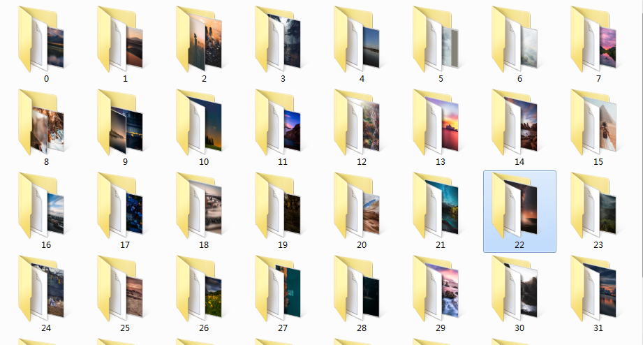

# 使用SCRAPY爬取图虫数据

## scrapy基本操作
1. 使用scrapy startproject projectName建立scrapy项目

        projectName/
            scrapy.cfg            # deploy configuration file
            projectName/          # project's Python module, you'll import your code from here
                __init__.py
                items.py          # project items definition file
                pipelines.py      # project pipelines file
                settings.py       # project settings file
                spiders/          # a directory where you'll later put your spiders
                    __init__.py
2. 进入项目文件夹，使用以下语句在spiders文件夹下生成爬虫程序

        scrapy genspider example example.com 
    
    example是爬虫名，example.com是目标域名
3. 编写爬虫程序
    
4. 在终端中运行

        scrapy crawl xxspider -o items.json     # 将结果输出到items.json中
        
        scrapy crawl xxspider # 一般这样写，通过pipelines输出到文件或者数据库

## 使用本项目
1. 在终端中执行

        scrapy crawl tuchong

    将会在项目根目录下生成item.json

    item.json示例

        {
            "url": "https://tuchong.com/4518305/23896199/",
            "title": "",
            "img_count": 18,
            "pic_urls": [
                "https://photo.tuchong.com/4518305/f/227869356.jpg",
                "https://photo.tuchong.com/4518305/f/581894799.jpg",
                "https://photo.tuchong.com/4518305/f/393872053.jpg",
                "https://photo.tuchong.com/4518305/f/136643252.jpg",
                "https://photo.tuchong.com/4518305/f/534971067.jpg",
                "https://photo.tuchong.com/4518305/f/357958379.jpg",
                "https://photo.tuchong.com/4518305/f/152830639.jpg",
                "https://photo.tuchong.com/4518305/f/352453308.jpg",
                "https://photo.tuchong.com/4518305/f/559219378.jpg",
                "https://photo.tuchong.com/4518305/f/177078921.jpg",
                "https://photo.tuchong.com/4518305/f/355598998.jpg",
                "https://photo.tuchong.com/4518305/f/160826055.jpg",
                "https://photo.tuchong.com/4518305/f/620626610.jpg",
                "https://photo.tuchong.com/4518305/f/376308355.jpg",
                "https://photo.tuchong.com/4518305/f/194577045.jpg",
                "https://photo.tuchong.com/4518305/f/637207185.jpg",
                "https://photo.tuchong.com/4518305/f/430834298.jpg",
                "https://photo.tuchong.com/4518305/f/367329959.jpg"
            ],
            "published_time": "2018-11-02 15:02:05",
            "favorites": 3804,
            "views": 11857,
            "tags": [
                "风光",
                "自然"
            ],
            "author_url": "https://tuchong.com/4518305",
            "comments": [
                "每张都是极致风光大片！",
                "手动点赞",
                "怎么我上传图片就失败",
                "谁能告诉我，为啥下载完跟这个节奏不一样？",
                "拍照真的太好了，每一张都是风光大片",
                "漂亮！精彩！学习！谢谢摄影师给我们带来的享受",
                "想请教您一下 自己的视频下载到自己手机清晰度降低 怎么解决呢？",
                "手动点赞",
                "大片"
            ]
        },
2. 执行download.py下载图片

    